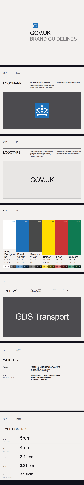
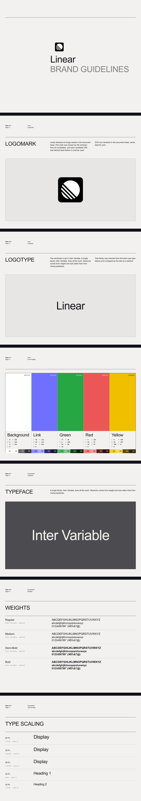
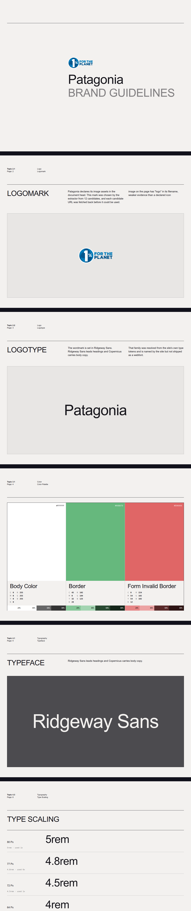
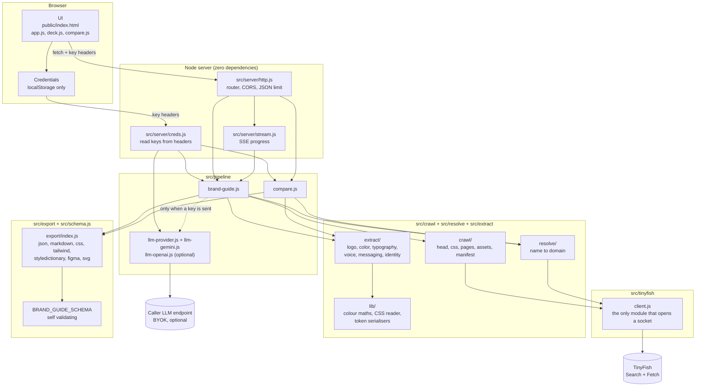

<div align="center">
  
</div>

<h1 align="center">BrandKit</h1>

<p align="center">Live brand guide extraction from any company name or URL.</p>

---

## Introduction

Give BrandKit a company name or a URL. It reads the live site and returns a
structured brand guide: verified logo assets, colour palette, typography, tone of
voice, and key messaging.

- **Every value comes from the live site**, not from a template or a guess.
- **Every value carries its source.** Colour, type, and logo are extracted
  deterministically from fetched markup and CSS.
- **The guide renders in the brand's own colours and typefaces**, set as a paged
  document rather than a screenshot.
- **Exports to tools you already use**: Figma Variables, Tailwind theme, CSS custom
  properties, Style Dictionary, Markdown, SVG.
- **No model is required.** The deterministic core is the default. An optional
  narration layer writes prose and cannot alter a measurement.

Built for the [TinyFish](https://www.tinyfish.ai) "Brand Guide Generator" bounty.
TinyFish Search and Fetch are the entire read layer: there is no direct `fetch()`
of the target site, no headless browser, and no scraping library.

## Tech Stack

<div align="center">


</div>

| Layer | Choice | Why |
| --- | --- | --- |
| Runtime | Node.js 20.18+, ESM | `node:test`, global `fetch`, `node:http` |
| HTTP server | `node:http`, hand written router | No framework, no middleware stack |
| Frontend | Vanilla JS, no build step | Served as static files the browser runs as written |
| Read layer | TinyFish Search + Fetch | See [How TinyFish is used](#how-tinyfish-is-used) |
| Colour maths | Local implementation | WCAG 2.1 contrast, CIEDE2000 |
| Schema | Local JSON Schema, self validating | `src/schema.js` |
| Exports | Local serialisers | Figma, Tailwind, CSS, Style Dictionary, SVG, Markdown |
| Narration | Optional, BYOK | Nine providers, off by default |

## Demo

<p align="center">
  
</p>

The GOV.UK guide above was extracted live and rendered in GOV.UK's own blue and
GDS Transport. A brand guide set in anything other than the brand is a screenshot,
not a guide.

<p align="center">
  
</p>

<p align="center">
  
</p>

Three deliberately awkward sites. Nothing is special cased in the code.

| Brand | Why it is a hard case | Confidence | Stylesheets | Typefaces found |
| --- | --- | --- | --- | --- |
| **Linear** | JavaScript SPA, design tokens hidden in 49 build hashed files | 0.74 | 49 | Inter Variable, Berkeley Mono |
| **GOV.UK** | No framework, no `<h1>`, tokens behind a vendor prefix | 0.77 | 2 | GDS Transport |
| **Patagonia** | Image led retail, typefaces only reachable through `var()` | 0.79 | 6 | Ridgeway Sans, Copernicus |

Extracted values, all checkable against the live sites:

| | Primary | Body text | Heading face | Body copy contrast |
| --- | --- | --- | --- | --- |
| Linear | `#7070ff` from `--color-brand-bg` | `#282a30` | Inter Variable | 14.34:1 AAA |
| GOV.UK | `#1d70b8` from `--govuk-brand-colour` | `#0b0c0c` | GDS Transport | 19.59:1 AAA |
| Patagonia | `#66b87d` (labelled `inferred`) | `#222222` | Ridgeway Sans | 15.91:1 AAA |

Notion appears nowhere in the code and was verified at `#1313ba` with NotionInter,
which is the evidence that the resolver is not tuned to the demo set. Reproduce any
of these by entering a brand in the UI.

## Local Setup

Requirements: Node.js 20.18 or later. A free TinyFish key from
[tinyfish.ai](https://agent.tinyfish.ai/api-keys). Nothing else. There is no
`node_modules` directory, because `package.json` declares no dependencies.

```bash
git clone https://github.com/GxAditya/brandguide.git
cd brandguide
npm start
```

Open `http://localhost:3000`, then open **Settings** in the header and paste your
TinyFish key. The key stays in your browser's `localStorage` and is sent per
request as a header. It is never stored on the server.

| Script | Does |
| --- | --- |
| `npm start` | Runs the server on port 3000 |
| `npm run dev` | Same, with `node --watch` |
| `npm test` | 215 tests, no network required |

### Endpoints

| Method | Path | Returns |
| --- | --- | --- |
| `POST` | `/api/v1/brand-guide` | The complete brand guide. Also available over `GET` so a guide can be linked to |
| `POST` | `/api/v1/compare` | Benchmark of 2 to 5 live brands |
| `GET` | `/api/v1/stream` | Server sent events, so the UI shows each source as it is read |
| `GET` | `/api/v1/health` | Liveness and the credential header names. Makes no upstream call |
| `GET` | `/api/v1` | The narration provider catalogue, authoritative |
| `POST` | `/api/v1/llm-check` | One minimal request against your narration credential |

`?format=` applies to brand-guide and compare: `json`, `markdown`, `css`,
`tailwind`, `styledictionary`, `figma`, `svg`.

```bash
curl -X POST http://localhost:3000/api/v1/brand-guide \
  -H 'content-type: application/json' \
  -H 'x-brandkit-tinyfish-key: sk-tinyfish-...' \
  -d '{"input":"linear"}'
```

## Architecture



Read path, in order:

1. `resolve/` turns a name into a domain with Search, rejecting hosted profile
   platforms.
2. `crawl/head.js` reads the document head with `include_selectors: ["head"]`.
3. `crawl/css.js` reads every stylesheet back as raw CSS.
4. `crawl/pages.js` follows links by generic path intent scoring.
5. `extract/` derives logos, colour, typography, voice, and messaging from those
   bytes, using `lib/` for colour maths and CSS reading.
6. `export/` serialises the same object into seven formats, and `schema.js`
   validates it.

## Supported LLM Providers

Optional. Used only to write the narrative, never a measurement. Pick one in
**Settings**, or send `X-BrandKit-Llm-Preset` per request.

Five free tiers need no payment method:

| Preset | Free | Default model | Note |
| --- | --- | --- | --- |
| `gemini` | yes | `gemini-3.1-flash-lite` | Called on Google's own API, not the OpenAI shape |
| `openrouter` | yes | `openrouter/free` | Routes to any free model with capacity |
| `groq` | yes | `openai/gpt-oss-120b` | Fastest of the free tiers |
| `nvidia` | yes | `nvidia/nemotron-4-340b-instruct` | 80 hosted models, retires often |
| `cerebras` | yes | `gpt-oss-120b` | Two models on shared inference |

Three paid, and one escape hatch:

| Preset | Default model | Note |
| --- | --- | --- |
| `openai` | `gpt-6.1-sol` | Text only on `/chat/completions`, tool calling needs Responses |
| `mistral` | `mistral-medium-latest` | |
| `deepseek` | `deepseek-flash` | 1M context, very cheap |
| `custom` | you choose | Any OpenAI compatible `/chat/completions` server |

Model ids rotate constantly and a retired id costs a whole run. The lists were
checked against each provider's own model list on **7 October 2026**:
OpenRouter, NVIDIA NIM and Gemini from their live list endpoints, Groq, Cerebras
and DeepSeek from their published docs, OpenAI and Mistral from their model pages.
`GET /api/v1` returns whatever the server currently holds and is authoritative.

Things worth knowing:

- **OpenRouter's `openrouter/free`** is the default on purpose. It always resolves
  to a free model with capacity, so it cannot go stale the way a pinned id does.
- **Groq publishes no zero priced models.** The free plan covers a short list,
  GPT-OSS and Qwen. The Llama ids are enterprise only.
- **Cerebras serves two models** on shared inference, `gpt-oss-120b` and
  `qwen-3.8-27b`. Its old Llama and Qwen ids are gone.
- **NVIDIA retires models often.** A retired id answers `410 Gone` by name.
- **Reasoning models reject `temperature`.** The retry ladder drops it, along with
  `response_format` and the token cap, one at a time, on refusal.

Two failure shapes are kept apart, because they mean different things:

- **Refused** (400, 404, 422): an unsupported field or a retired model id. Retry
  the same call with less on it.
- **Unavailable** (429, 5xx): a smaller body cannot help, and trying one would
  spend quota to prove it. Retry the identical request with backoff, and on Gemini
  move to a different model.

With no key configured everything else works identically. That is the default, and
it is how the demo runs.

## How TinyFish is used

**Every byte of the target site enters through TinyFish.** Search and Fetch are the
only two surfaces used, both free at any balance, so the default path costs
nothing.

| Surface | Endpoint | Method | Role in this project |
| --- | --- | --- | --- |
| Search | `https://api.search.tinyfish.ai/` | `GET` | Resolve a company name to its official domain. Find competitors for `POST /api/v1/compare` |
| Fetch | `https://api.fetch.tinyfish.ai` | `POST` | Read the document head, every stylesheet, content pages, manifests, and image assets |

Both base URLs are overridable with `TINYFISH_FETCH_URL` and
`TINYFISH_SEARCH_URL`. `src/tinyfish/client.js` is the only module in the codebase
that opens a socket to a target site.

Five load bearing uses:

| What | How |
| --- | --- |
| Name to domain | `Search` with `query`, results scored on URL parts |
| Brand metadata | `Fetch` with `include_selectors: ["head"]`, `format: "html"` |
| Design tokens | `Fetch` on each stylesheet URL, `format: "markdown"` to get raw CSS back |
| Copy across pages | `Fetch` with `format: "html"`, `links: true`, `image_links: true` |
| Logo existence | `Fetch` on the asset URL, read from its error code |

Two decisions matter more than the rest:

- **`include_selectors: ["head"]` is the single most important call.** By default
  Fetch returns cleaned semantic HTML with `<head>`, `<style>`, and `<link>`
  stripped, which is ideal for reading copy and useless for reading a brand: no
  `og:image`, no `theme-color`, no stylesheet URLs. Scoping the same fetch to the
  head returns it verbatim. One call then yields every piece of first party
  metadata a site publishes about itself, plus its full stylesheet list.
- **Fetch renders in a real browser, so its error code proves an asset exists.**
  For an image URL, `empty_content` means it resolved and has no text to extract,
  and `page_not_found` means it is gone. The absence of text is the proof of
  existence, which is how the extractor never returns a dead logo link.

Browser and Agent are deliberately unused. They are metered, and not needed:
Fetch already renders, so a JavaScript heavy site reads as well as a static one.

Limits: 10 URLs per Fetch call, roughly 150 URLs per minute per key, and a 120s CDN
ceiling per batch with the client timeout at 150s. Stylesheet batches run two at a
time, because firing all five at once once lost a third of them and took the
`@font-face` rules with them. The client honours `Retry-After` and retries with
jittered backoff.

Deeper detail, including the reasoning behind each decision, is in
[docs/TINYFISH.md](docs/TINYFISH.md).

## Architectural Decisions

### Why bring your own key

- **A deployment is a public URL and nothing else.** The server holds no
  credentials at all.
- **Two people on one instance spend their own quota**, and there is nothing stored
  to leak or to rotate.
- **Keys arrive per request in headers**, are used for that request, and are never
  logged or returned. The server logs a request path and an error code on failure,
  never headers and never bodies.
- **Not the query string.** A secret in a URL lands in proxy logs and browser
  history.
- **Not a request body**, because the live progress endpoint is a `GET` and an
  `EventSource` cannot carry one.
- **The browser is the only place a key can exist**, since the server stores none.
  It lives in `localStorage`, falls back to memory when storage is refused (Safari
  private mode), and says so in the panel rather than pretending the save will
  outlive the tab.
- **A key never touches disk on the server.** There is no environment variable to
  set and no config file to create.

### Why no framework and no dependencies

- **0 runtime dependencies, so `node_modules` does not exist.** A clone runs with
  `npm start`.
- **Cold start is the whole cost of a free render plan.** Nothing to compile,
  bundle, transpile, or warm. The server is `node:http` and a hand written router.
- **No build step for the frontend either.** `public/` ships as written and the
  browser runs it directly.
- **Fewer supply chain surfaces.** An extraction tool that reads arbitrary
  untrusted markup has no business carrying transitive dependencies.
- **The hard parts are domain specific, not framework shaped.** CIEDE2000, WCAG
  contrast, SVG sanitisation, and CSS custom property alias resolution are all
  written here, because no library does them the way this product needs.
- **215 tests run with no network**, which is only practical without a mocking
  layer to keep in sync.

### Why the model cannot change a fact

- **Deterministic core, always on.** Colour, contrast, token graphs, and
  sentence level linguistic measurement are computed locally from fetched bytes.
  Reproducible, auditable, free.
- **Interpretation is a separate `narrative` block**, parsed into a fixed shape and
  attached after generation, so it is structurally incapable of overwriting
  `colors`, `typography`, or `logos`.
- **The model never sees raw HTML**, only a compact fact sheet of measured values.
- **Every sentence without a supporting source URL is dropped.**
- **Any sentence it returns that cannot be found quoted in the source copy is
  discarded**, so pillars cannot be invented.

### Security techniques

- **SVG sanitisation before the source leaves the server.** Logos are inlined
  rather than loaded through ``, because an image cannot inherit from the
  page and `fill="currentColor"` resolves to black across that boundary. That is a
  script injection risk, so scripts, event handlers, external `href`, external
  `url()` paint servers, `DOCTYPE` and `ENTITY` declarations, and `javascript:` are
  all stripped.
- **The client never assigns to `innerHTML`.** It parses with `DOMParser` and
  adopts nodes one at a time.
- **`svgTone` reads the mark's own fills and gradient stops** and reports `light`,
  `dark`, or `inherit`, so a white logo is never placed on a white page.
- **Logo URLs are verified before they are returned.** A candidate is rejected
  unless Fetch confirms it resolves.
- **Private IPs and localhost are rejected upstream**, so SSRF is TinyFish's
  boundary rather than ours.
- **Fetched CSS is size capped** at 2MB per stylesheet, and the router caps the
  JSON body length.
- **Secrets are never logged or echoed back**, and error messages name a provider
  or a status code, never a key.
- **A model cannot invent a measurement.** See the section above.

## Reference Docs

Read in this order if you want to understand the project properly:

| Document | What it covers |
| --- | --- |
| [docs/PRD.md](docs/PRD.md) | The product requirement: problem, read layer, endpoints, accuracy strategy, UI design decisions |
| [docs/TINYFISH.md](docs/TINYFISH.md) | How the read layer works in depth, why Fetch and not a scraper, the two retry ladders, cost and rate limits |
| [docs/CRITERIA.md](docs/CRITERIA.md) | Each approval criterion mapped to the code and the tests that cover it |
| [docs/TASKS.md](docs/TASKS.md) | The build log: what shipped, what was found along the way, and nine recorded deviations |
| [src/schema.js](src/schema.js) | The JSON Schema the output validates against. Enforces provenance, so an unverified asset cannot be represented |

### Source layout

```text
src/
  tinyfish/       client.js, the only module that opens a socket to a target site
  resolve/        input classification, name to domain ranking
  crawl/          head, stylesheets, manifest, pages, asset verification
  extract/        logo, colour, typography, identity, voice, messaging
  lib/            colour maths, CSS reader, token serialisers, page budget
  pipeline/       brand-guide, compare, and the optional narration layer
  export/         markdown, CSS, Tailwind, Style Dictionary, Figma, SVG
  server/         zero dependency HTTP server, credential handling, SSE
public/           the UI, served as written with no build step
test/             215 tests, no network required
```

## Licence

MIT. See [LICENSE](LICENSE).
